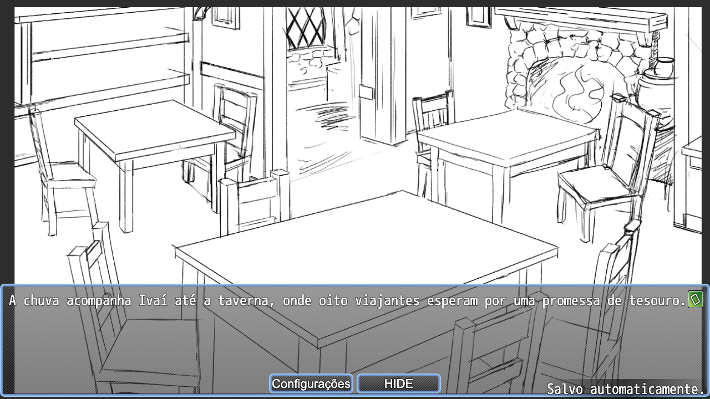
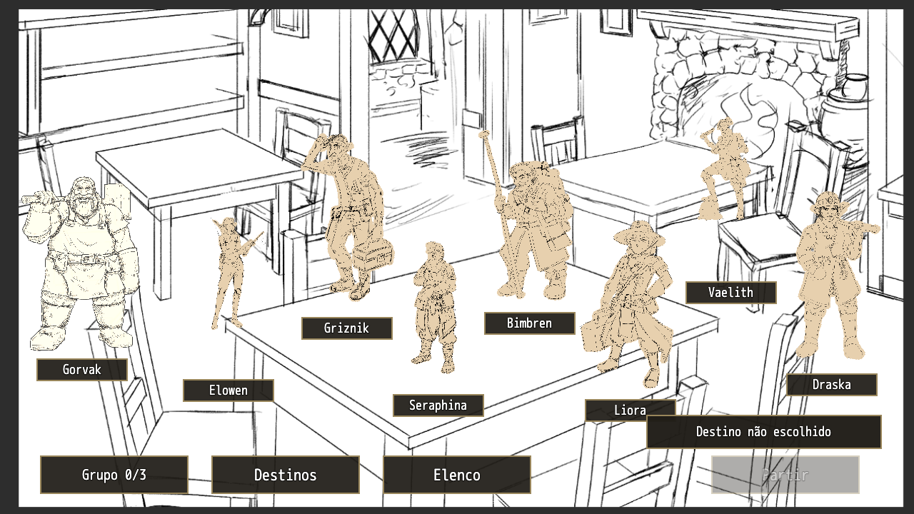

# Jogar retornava ao título em vez de iniciar a campanha

- **Data:** 10 de setembro de 2026.
- **Estado:** correção publicada; fluxo inicial validado no Chrome do macOS. Reteste no Windows pendente.
- **Commit que introduziu a configuração incorreta:** `d625820`.
- **Commit da correção:** `7dfc538`.
- **Revisão nativa corrigida:** `mz-20260910-22`.

## Impacto observado

Um jogador no Windows, executando o projeto por `npm start` na porta padrão 18726, conseguia abrir a tela inicial e usar Configurações. Ao clicar em Jogar, voltava à mesma tela. Isso impedia iniciar uma campanha nova. A investigação reproduziu o comportamento no Chrome do macOS com os arquivos do repositório. Não foi medido o número de jogadores afetados; não há evidência de perda de saves neste incidente.

O relato inicial incluía o aviso `The provided value 'undefined' is not a valid enum value of type CanvasTextAlign`. Ele desviou a hipótese inicial para renderização de texto. Ao esclarecer que não havia erro vermelho e que o menu reaparecia a cada clique, a investigação passou a examinar o destino de Novo jogo.

## Causa

O commit `d625820` alterou a posição inicial global em [System.json](<../../../rpg-maker/The Dryland Drowned/data/System.json>):

| Campo | Configuração anterior | Configuração que causava o loop |
|---|---:|---:|
| `startMapId` | 2 — Prólogo | 1 — Título |
| `startX` | 10 | 1 |
| `startY` | 7 | 0 |

O plugin `VisuMZ_4_EventTitleScene` usa o mapa 1 para apresentar o título. O evento comum 2, chamado pelo evento automático desse mapa, mostra Jogar e Configurações. Jogar chama o comando `NewGame` do plugin. O motor prepara uma sessão nova e transfere o jogador para a posição de `System.json`.

Com o início apontando para o mapa 1, a sessão nova entrava no próprio mapa que executa o menu. O clique era processado; seu destino estava incorreto. Na reprodução, a cena passou de `Scene_EventedTitleMap` para `Scene_Map`, mas o mapa continuou sendo 1 e a campanha permaneceu na fase `ready`.

O histórico demonstra a alteração dos valores. A ação exata no editor que produziu a mudança não foi observada e não é atribuída a uma pessoa neste registro.

A separação entre título, prólogo e taverna é confirmada pelo [GDD canônico, seção 1.1](../../GDD_Visual_Novel_Expedicao_e_Sacrificio.md). Restaurar a posição anterior recupera esse comportamento; não cria uma nova decisão de design.

## Por que não era o aviso de Canvas

O motor recebe chamadas de desenho sem alinhamento explícito e repassa `undefined` a `context.textAlign`. Um teste isolado no Chrome 152 reproduziu a mensagem como aviso, sem lançar exceção. O teste do jogo também reproduziu o retorno ao menu sem erro de execução.

O aviso não explica a transferência para o título. Esta correção não alterou o motor nem os plugins para silenciá-lo.

## Investigação e alcance da revisão

1. O relato foi refinado de “erro ao clicar” para “menu reaparece, sem erro vermelho”.
2. A leitura do histórico identificou a mudança da posição inicial.
3. Um clique real no Chrome do Mac reproduziu a entrada da nova sessão no mapa 1.
4. Uma cópia temporária com apenas os três campos restaurados abriu o prólogo e chegou à taverna.
5. A correção foi aplicada no projeto, a revisão nativa foi atualizada e uma nova cópia sem modificações adicionais passou pelo mesmo percurso.
6. O commit `7dfc538` foi enviado para `origin/main`; este postmortem foi escrito depois desse envio.

A revisão estática percorreu **36 mapas, 67 eventos comuns e 34 comandos nativos de transferência**. Não encontrou referências ausentes, coordenadas de destino fora dos limites nem transferências para os mapas usados apenas como agrupadores (5, 6 e 24). Somente o mapa 1 chama o evento comum de entrada.

Os 16 mapas de armadilhas, o Conselho, os três finais e os oito epílogos usam destinos coerentes no evento comum 40. As transferências pertinentes verificam se o jogador já está no mapa de destino. Os retornos explícitos ao título nos eventos comuns 61 e 66 pertencem aos créditos e à tela de campanha indisponível.

Os arquivos dos 36 mapas, `CommonEvents.json` e `MapInfos.json` não apresentaram mudanças semânticas em comparação com `88453f3`. Isso sustenta a localização desta regressão na entrada global, mas não prova ausência de outros defeitos de gameplay. Os demais percursos não foram jogados integralmente nesta investigação.

## Correção aplicada

A posição inicial foi restaurada para **mapa 2, X=10, Y=7**. O plugin de título permaneceu no mapa 1. Nenhum evento de mapa, comando de campanha ou plugin foi alterado.

Havia também uma inconsistência de revisão: `validate-content.mjs` retornava `native_layout_mismatch`. Os bytes de `System.json`, `CommonEvents.json` e `MapInfos.json` não correspondiam aos hashes registrados. Nos dois últimos, a representação havia mudado sem alterar o conteúdo semântico.

Depois de corrigir a posição, foi executado o mecanismo existente:

```sh
node rpg-maker/tools/revise-layout.mjs --revision mz-20260910-22
node rpg-maker/tools/validate-content.mjs --json
```

A revisão nova registra os arquivos atuais e preserva as revisões históricas. Pelo contrato existente, saves com uma revisão nativa anterior são tratados como incompatíveis. Não foi implementada migração nem testado um carregamento entre revisões nesta correção.

## Validação da versão corrigida

Ambiente: **macOS, Chrome 152.0.7977.83, Node 22.23.2**, viewport 1280 × 720 e DPR 1 na execução final. O teste usou o mesmo `start-game.mjs` do projeto, com `--no-open`, em uma cópia dos arquivos corrigidos e contexto de navegador sem saves anteriores. A porta 18728 foi usada porque 18726 e 18727 já estavam ocupadas; nenhum processo existente foi encerrado.

| Verificação | Resultado e limite |
|---|---|
| Jogar → Prólogo | Passou: clique por mouse entrou no mapa 2, fase `intro` |
| Leitura → Taverna | Passou: três trechos avançados por Enter; mapa 3, fase `formation`, oito heróis disponíveis |
| Erros de execução na jornada | Nenhum registrado na execução final |
| Conteúdo e revisão | `{"ok":true,"errors":[]}` |
| Diff | `git diff --check` passou; alteração semântica de System limitada aos três campos de posição |
| Testes selecionados por `^UT-` | 65 passaram; UT-059 falhou na preparação do servidor por porta 18726 ocupada |
| Windows, campanha completa e Continue entre revisões | Não executados nesta correção |

O comando `node --test --test-name-pattern='^UT-' rpg-maker/tests/campaign.test.mjs` terminou com **exit 1**, por causa da preparação do UT-059, que usa um navegador apesar de seu prefixo. Não se declara que a suíte completa passou. Essa falha de infraestrutura foi preservada e não foi corrigida alterando o teste ou encerrando o servidor existente.

Tentativas anteriores do teste dirigido falharam antes do clique por preparação de janela ou divergência entre escala configurada e dimensões da captura. Esses resultados não foram tratados como falhas do produto nem como passes. A execução final usou DPR 1, capturou imagens de 1280 × 720, completou a jornada e encerrou seus próprios recursos.

As capturas abaixo foram inspecionadas. O [resumo de evidências](evidencias.json) preserva hashes dos arquivos relevantes e das imagens. Os logs brutos permanecem no acervo local `.artifacts/title-loop-check/` e não são necessários para ler este documento.





## Aprendizados e prevenção

O teste existente IT-001 já exige entrar no mapa 2 após Jogar. O validador de conteúdo também sinalizava que os arquivos e o manifesto divergiam. Não há evidência nesta investigação de que essas verificações tenham sido executadas sobre o commit que introduziu o problema; não se presume uma falha de CI específica.

Medidas recomendadas, **ainda não implementadas neste incidente**:

- Adicionar ao validador uma verificação semântica da posição inicial: mapa existente, coordenadas válidas e entrada no prólogo, distinta do mapa de título. Um manifesto atualizado sozinho não garante um destino correto.
- Tornar o percurso Jogar → Prólogo → Taverna uma verificação antes de compartilhar alterações feitas pelo editor, reaproveitando o contrato do IT-001.
- Corrigir separadamente a dependência de porta fixa dos testes que precisam iniciar seu próprio servidor.
- Investigar o aviso de Canvas em um trabalho separado, sem confundi-lo com a causa de falhas de navegação.

Para o devlog, o momento demonstrável é clicar em Jogar e chegar à formação após o prólogo. As duas capturas preservadas mostram esse resultado; não representam aprovação artística das imagens provisórias.
