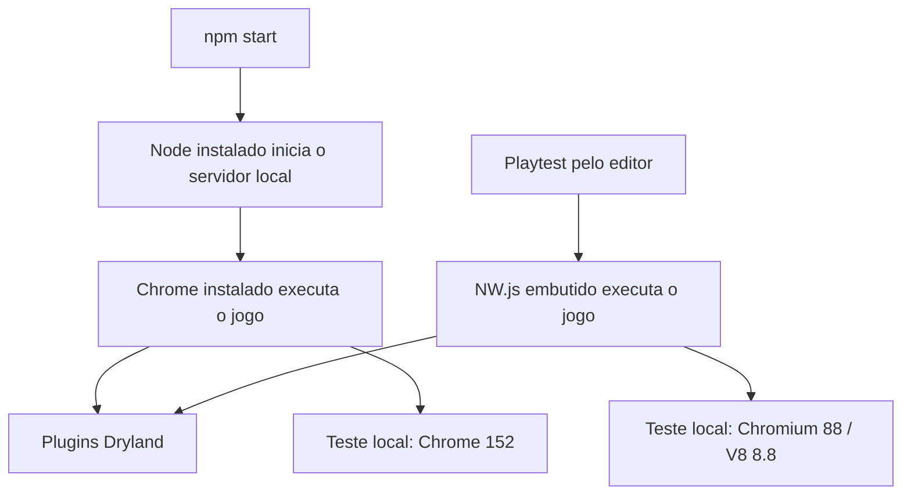
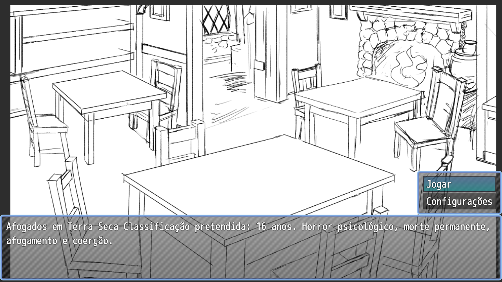

# Playtest do editor não abria: APIs JavaScript ausentes no NW.js

- **Data do incidente e da pesquisa:** 10 de setembro de 2026.
- **Estado:** correção publicada; usuário confirmou o funcionamento no Windows após o reteste.
- **Commit da correção:** `ca4dadc4213508f644090c0fb5b8cb10f6bdce0b`.
- **Escopo:** inicialização pelo editor RPG Maker MZ e compatibilidade dos plugins próprios com seu runtime embutido.

## O que aconteceu

Ao iniciar o playtest pelo editor no Windows, o jogo parava antes de apresentar a tela inicial. O erro relatado começava assim; os números de linha pertencem à versão anterior à correção:

```text
TypeError: Object.hasOwn is not a function
    at declaration (Dryland_EventBridge.js:127)
    at parseEventCatalog (Dryland_EventBridge.js:204)
    at Function.DataManager.isDatabaseLoaded (Dryland_EventBridge.js:373)
    at Scene_Boot.isReady (rmmz_scenes.js:276)
```

O carregamento dependia de uma função que não existia naquele ambiente JavaScript. Os plugins próprios usavam APIs mais recentes que o runtime embutido testado. A validação em Node e Chrome atuais não havia exposto essa diferença.

O impacto observado foi o bloqueio da abertura do jogo pelo editor. Não foram medidos alcance entre jogadores, duração total ou perda de saves. Após a publicação da correção, o usuário informou: **“Funcionou lá!”**. Essa confirmação encerra o relato de bloqueio, mas não fornece a versão exata do Windows/NW.js nem comprova uma campanha completa nesse ambiente.

Este incidente é distinto do [retorno ao título ao clicar em Jogar](../2026-09-10-jogar-retorna-ao-titulo/2026-09-10-jogar-retorna-ao-titulo.md). Naquele caso, o jogo carregava e iniciava a sessão no mapa errado. Aqui, a exceção acontecia durante o carregamento do catálogo, antes de qualquer escolha no menu. O aviso anterior de `CanvasTextAlign` não explica esta pilha de erro.

## Causa raiz: dois caminhos de execução, runtimes diferentes

O comando de desenvolvimento e o playtest do editor abrem os mesmos plugins por caminhos diferentes:



O NW.js integra Chromium e Node.js. Sua documentação expõe as versões embutidas em `process.versions.nw` e `process.versions.chromium`; o lançamento oficial do NW.js 0.51.0, de **22/01/2021**, informa Chromium **88.0.4324.96**. Essa versão coincide com a medição realizada no executável disponível na instalação local do editor. [Documentação de versões do NW.js](https://github.com/nwjs/nw.js/blob/main/docs/References/Changes%20to%20Node.md), [lançamento 0.51.0](https://nwjs.io/blog/v0.51.0/).

Consequentemente, atualizar o Node usado pelo servidor ou o Chrome instalado separadamente não substitui o NW.js do editor. No caminho `npm start`, a exigência de Node 22+ atende à ferramenta que serve os arquivos; ela não estabelece a versão de JavaScript disponível dentro do playtest. Essa conclusão decorre dos dois caminhos de execução e das versões medidas, sem presumir uma versão única de NW.js para todas as instalações de RPG Maker MZ.

| Ambiente | Versões observadas | Evidência e alcance |
|---|---|---|
| NW.js da instalação local do editor, macOS | NW.js 0.51.0; Chromium 88.0.4324.96; V8 8.8.278.14; Node 15.5.1 | Medição em execução real; abertura até o título |
| Navegador local, macOS | Chrome 152.0.7977.83; Node do processo de teste 22.23.2 | Jornada dirigida de Jogar até a taverna |
| Editor do colega, Windows | Versões não informadas | Pilha de erro recebida e confirmação humana após a correção |

### A diferença de suporte que explica a falha

| API usada pelos plugins | Disponível no Chrome a partir de | Disponível no Node a partir de | Runtime local do editor |
|---|---:|---:|---|
| `Object.hasOwn` | 93 | 16.9.0 | `typeof Object.hasOwn === "undefined"` |
| `Array.prototype.at` | 92 | 16.6.0 | `typeof Array.prototype.at === "undefined"` |

Os limites de versão vêm dos dados de compatibilidade mantidos pela MDN: [Object.hasOwn](https://raw.githubusercontent.com/mdn/browser-compat-data/main/javascript/builtins/Object.json) e [Array.at](https://raw.githubusercontent.com/mdn/browser-compat-data/main/javascript/builtins/Array.json). As duas ausências foram também medidas no NW.js local, independentemente da tabela.

As publicações do V8 corroboram a cronologia: em julho de 2021, `Object.hasOwn` era apresentado no V8 9.3 ainda sob flag, enquanto `at` aparecia no anúncio do V8 9.2 associado ao Chrome 92. Portanto, o Chromium 88 precede ambas as funcionalidades. [V8: Object.hasOwn](https://v8.dev/features/object-has-own), [V8 9.2](https://v8.dev/blog/v8-release-92).

Há duas precauções na leitura dessas fontes: o selo “disponível entre navegadores desde março de 2022” da MDN não é a data de estreia no Chrome; e o artigo histórico do V8 ainda mostra Node sem suporte, informação que não deve ser aplicada às versões atuais. Para os limites numéricos acima, foram usados os dados de compatibilidade, cruzados com a medição real. [MDN: Object.hasOwn](https://developer.mozilla.org/en-US/docs/Web/JavaScript/Reference/Global_Objects/Object/hasOwn).

### Por que falhava antes de abrir o menu

O [EventBridge](<../../../rpg-maker/The Dryland Drowned/js/plugins/Dryland_EventBridge.js>) estende `DataManager.isDatabaseLoaded`. Depois de o motor carregar o banco, ele chama `parseEventCatalog` para ler as declarações dos eventos comuns e construir o catálogo usado pelas regras.

Dentro de `declaration`, a validação chamava `Object.hasOwn`. O acesso à propriedade inexistente produzia `undefined`; tentar chamá-la como função lançava o `TypeError`. Isso interrompia a preparação de `Scene_Boot`, impedindo a chegada ao título. A linha de `rmmz_managers.js` no console era o ponto em que o motor reportava a exceção; a chamada incompatível estava no plugin próprio.

O histórico já contém esse uso em `88453f3`. Isso localiza a dependência em uma revisão do projeto; não identifica a ação de autoria original nem permite atribuir a falha a uma pessoa. A causa de processo sustentada pelas evidências é uma lacuna de cobertura entre runtimes: passar em versões modernas não detectava a ausência dessas APIs no editor. Não foi demonstrada uma falha específica de CI.

## Correção e alcance da revisão

A revisão encontrou **11 chamadas de `Object.hasOwn`** nos dois plugins próprios: sete no EventBridge e quatro em [CampaignRules](<../../../rpg-maker/The Dryland Drowned/js/plugins/Dryland_CampaignRules.js>). Também encontrou **cinco chamadas de `.at(-1)`** no EventBridge: duas no parser de ramificações e três na quebra de legendas do memorial. Corrigir apenas a primeira linha da pilha deixaria outras dependências incompatíveis.

Cada plugin passou a usar uma função privada:

```js
const hasOwn = (object, key) => Object.prototype.hasOwnProperty.call(object, key);
```

Essa forma mantém a checagem de propriedade própria, inclusive se o objeto não tiver protótipo ou possuir uma propriedade chamada `hasOwnProperty`. Usar `in` aceitaria também propriedades herdadas; chamar diretamente `object.hasOwnProperty` dependeria do método exposto pelo objeto. A distinção importa para validar declarações e ações do jogo. [Semântica documentada pela MDN](https://developer.mozilla.org/en-US/docs/Web/JavaScript/Reference/Global_Objects/Object/hasOwn).

Os acessos ao último elemento passaram a usar `array[array.length - 1]`; na quebra de legendas, o último texto é guardado em `lastLine`. A substituição atende aos usos concretos de índice `-1` encontrados nesses arrays, sem pretender implementar uma versão geral de `at`.

A correção não adiciona polyfills globais, dependências ou etapa de build. Mantém a validação de conteúdo ativa e preserva mapas, parâmetros de plugins, formato de save e arquivos do motor. A revisão nativa não precisou mudar porque esta alteração não modificou os dados cobertos pelo manifesto.

## Sequência da resposta

1. O relato identificou a falha ao abrir pelo editor, antes do menu.
2. A investigação localizou a chamada no carregamento do catálogo e as demais dependências das duas APIs.
3. A regressão foi reproduzida em um contexto JavaScript sem essas funções, antes de alterar os plugins.
4. As chamadas foram substituídas, e a cobertura foi incorporada ao caso existente UT-047.
5. Foram executados testes selecionados, abertura no NW.js antigo e jornada inicial no Chrome atual.
6. A correção foi enviada para `origin/main` em `ca4dadc`. O commit foi criado em 10/09/2026 às 16:44:55 −03:00; esse horário não mede o momento do push.
7. O usuário confirmou o funcionamento no Windows; a pesquisa documental foi feita depois para este registro.

Os demais marcos não têm horários registrados neste documento; não se estima um tempo total de resolução.

## Evidências e limites da validação

| Verificação executada | Resultado | Limite |
|---|---|---|
| UT-047 antes da correção | Reproduziu `Object.hasOwn is not a function` | Contexto isolado de Node, sem as APIs |
| UT-047 depois | Passou com ausência de `hasOwn`, de `at` e de ambas | Não simula todas as diferenças de um V8 antigo |
| Seleção `^UT-(?!059 )` | 65 testes passaram | UT-059 excluído por depender da porta 18726 ocupada; não é passe da suíte completa |
| Validador de conteúdo | Passou | Validação estática |
| NW.js 0.51.0 real no macOS | Chegou a `Scene_EventedTitleMap`, mapa 1, com Jogar e Configurações; campo de erro vazio | Abertura até o título; campanha não percorrida nesse runtime |
| Chrome 152 no macOS | Clique em Jogar → mapa 2; três trechos do prólogo → mapa 3, fase `formation`, oito heróis; sem erros registrados | Jornada inicial, não campanha completa |
| Reteste no Windows | Usuário informou “Funcionou lá!” | Confirmação humana, sem captura ou versões do ambiente |

O [UT-047 em content.mjs](../../../rpg-maker/tests/suites/content.mjs) carrega o código real dos dois plugins e o conteúdo real do projeto em três contextos isolados. Verifica catálogo, início da campanha, validade do estado e rejeição da ação herdada `toString`. A remoção das APIs ocorre nesses contextos, sem alterar os objetos globais do processo de testes.

O teste nativo usou uma cópia do projeto e um perfil separado do NW.js instalado. Tentativas de preparação com perfil incompatível e cópia em diretório temporário não foram contabilizadas como passes; a execução final corrigiu a preparação, sem alterar o motor. A inspeção do boot foi somente leitura. Não houve execução integral do memorial ou da campanha no NW.js, nem teste de migração de saves nesta correção.

O [registro de evidências](evidencias.json) preserva versões, resultados selecionados, hashes de arquivos e capturas, incluindo o [prólogo](chrome-after-jogar.png) e a [taverna no Chrome](chrome-tavern.png). O [resultado bruto do boot](nw-boot.json) registra que as duas APIs continuavam ausentes quando o título abriu. Os logs de [reprodução antes da correção](unit-before.txt), [UT-047 corrigido](unit-final.txt) e [65 testes selecionados](unit-all-after.txt) foram preservados nesta pasta; o relatório extenso do navegador permanece em `.artifacts/title-loop-check/result-editor-compat-chrome/report.json` no acervo local.



Momento demonstrável para devlog: a tela inicial abre no runtime antigo do editor com os plugins corrigidos. A imagem demonstra a apresentação do título; a ausência das APIs é demonstrada pelo JSON, não pela captura.

## Prevenção

A regressão no UT-047 já está implementada. As ações abaixo são **propostas pendentes**, sem responsável ou prazo acordado neste incidente:

| Ação proposta | Critério de conclusão |
|---|---|
| Documentar a matriz de runtimes suportados | Registrar versões reais do editor/NW.js da equipe e o mínimo assumido pelos plugins |
| Incluir abertura no runtime mínimo na verificação de entrega | Evidência de título, Jogar e chegada à taverna na versão declarada |
| Revisar APIs novas nos plugins contra essa matriz | Checagem de compatibilidade contemplar métodos de runtime, além de sintaxe |
| Ampliar o teste nativo para os percursos afetados ainda não jogados | Executar campanha e memorial no NW.js suportado, registrando resultados |

Um teste que remove APIs conhecidas é uma proteção específica e barata; o boot no executável antigo cobre diferenças reais de execução. São evidências complementares. A adoção futura de um NW.js mais recente exigiria avaliar a compatibilidade do conjunto de plugins e distribuição; essa atualização não foi realizada nem necessária para esta correção.

## Método da pesquisa

Foram cruzados código e histórico do repositório, evidências locais, documentação oficial do NW.js/V8 e dados de compatibilidade da MDN. O Context7 foi consultado na biblioteca `/nwjs/nw.js` para localizar a documentação de integração e de `process.versions`; a referência de versões foi conferida diretamente no repositório oficial. Context7 foi usado como mecanismo de consulta, sem contá-lo como uma fonte independente adicional.

As fontes estão vinculadas junto às afirmações e foram consultadas em **10/09/2026**. A documentação explica a incompatibilidade observada; ela não revela a versão não informada do computador do colega. O fechamento combina a reprodução controlada da falha, os testes da correção e a confirmação humana do reteste.
