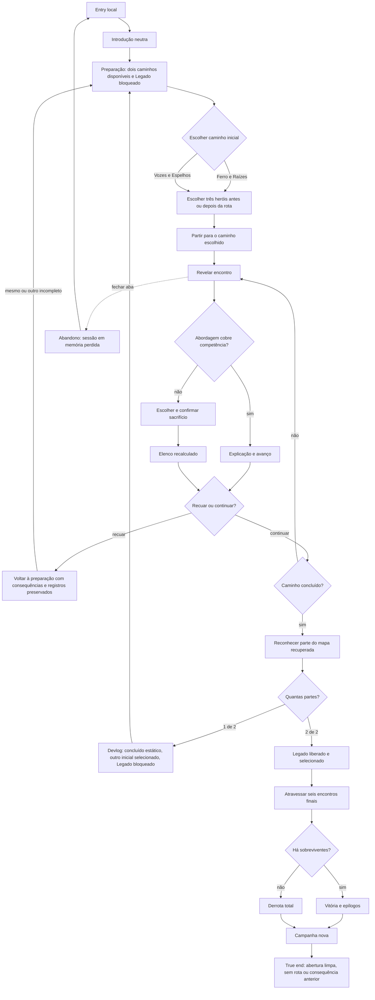

# Concluir a campanha completa em qualquer ordem



```yaml
journey:
  id: J-complete-campaign
  name: Concluir expedição em qualquer ordem
  value_statement: "O jogador escolhe a ordem dos dois caminhos iniciais, administra perdas e alcança um desfecho coerente pelo Caminho do Legado."
  personas: ["Lia, primeira expedicionária", "Caio, estrategista recorrente", "Joana, jogadora ampliada", "Rui, revisor de conteúdo"]
  entry_points:
    - url: file:///…/prototype/index.html
      origin: direct
  actions:
    - step: 1
      verb: Comparar os dois caminhos iniciais e o Legado bloqueado
      expected_observable: Dois rádios começam desmarcados e o terceiro cartão explica a exigência de duas partes do mapa
    - step: 2
      verb: Escolher destino e três heróis em qualquer ordem
      expected_observable: As duas escolhas são preservadas e a partida compromete somente o caminho selecionado
    - step: 3
      verb: Resolver encontros, sacrificar ou recuar para trocar de caminho
      expected_observable: Mortes, atribuições e maior percurso permanecem ligados ao caminho correto, mas a nova tentativa recomeça no primeiro marco
    - step: 4
      verb: Concluir os dois caminhos iniciais em qualquer ordem
      expected_observable: Cada concluído vira cartão estático, o outro fica selecionado e o Legado só libera com 2 de 2 partes
    - step: 5
      verb: Atravessar o Caminho do Legado e iniciar campanha nova
      expected_observable: Seis encontros levam a vitória ou derrota e o reset remove toda consequência da sessão anterior
  goal:
    observable: As ordens Ferro/Vozes e Vozes/Ferro convergem para o Legado e um desfecho sem repetição de caminho concluído
    side_effects: [historico-aceito-da-sessao, atribuicoes-por-caminho, partes-do-mapa]
  true_end_state: Iniciar campanha nova retorna à abertura sem mortes, atribuições, partes do mapa, rota selecionada ou rota ativa
  exit:
    natural: nova campanha pronta
  abandonment:
    - at_step: 3
      how: Fechar ou recarregar a aba durante uma consequência ou preparação
      resume: Uma sessão limpa aparece, sem recuperação implícita
  crosses: [preparacao, encontros, imagens, caminhos, fragmentos, desfechos, acessibilidade]
```
