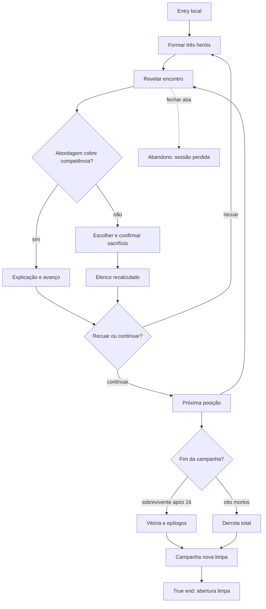

# Concluir a campanha completa



```yaml
journey:
  id: J-complete-campaign
  name: Concluir expedição e sacrifício
  value_statement: "O jogador atravessa 5+5+6 encontros, administra perdas e recebe um desfecho coerente."
  personas: [Lia, primeira expedicionária, Caio, estrategista recorrente]
  entry_points:
    - url: file:///…/prototype/index.html
      origin: direct
  actions:
    - step: 1
      verb: Formar a expedição com competências visíveis
      expected_observable: Apenas três heróis partem quando há elenco amplo
    - step: 2
      verb: Escolher abordagens sem rótulo interno
      expected_observable: Resultado explica a competência somente após o compromisso
    - step: 3
      verb: Sacrificar ou recuar quando permitido
      expected_observable: Mortes e posições persistem na sessão
    - step: 4
      verb: Atravessar as três masmorras
      expected_observable: Cinco, cinco e seis posições levam a vitória ou derrota
  goal:
    observable: Um desfecho aparece e campanha nova limpa todo o progresso
    side_effects: [historico-da-sessao, atribuicoes-progressivas]
  true_end_state: Iniciar nova campanha retorna à abertura sem mortes ou posições
  exit:
    natural: nova campanha pronta
  abandonment:
    - at_step: 3
      how: Fechar a aba durante uma consequência
      resume: Abertura limpa sem recuperação implícita
  crosses: [formacao, encontros, imagens, masmorras, desfechos]
```
