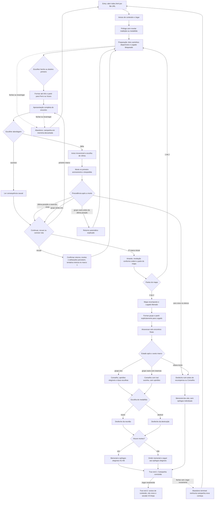

> Historical record: the HTML implementation has been retired. Procedures and source references below describe that past delivery only; do not execute them, recover its source, or treat its results as evidence of the current game. Current implementation: `rpg-maker/The Dryland Drowned/`; current tests: `rpg-maker/tests/`.

# Concluir a campanha completa em qualquer ordem



```yaml
journey:
  id: J-complete-campaign
  name: Concluir expedição em qualquer ordem
  value_statement: "O jogador prepara a equipe, administra perdas e alcança um dos três desfechos canônicos sem receber informação mecânica privada."
  personas: ["Lia, primeira expedicionária", "Caio, estrategista recorrente", "Joana, jogadora ampliada", "Rui, revisor de conteúdo"]
  entry_points:
    - url: retired HTML artifact (index.html)
      origin: direct
  actions:
    - step: 1
      verb: Ler avisos e prólogo, então preparar heróis e um dos dois caminhos iniciais em qualquer ordem
      expected_observable: A UI mostra nomes, rumores e estados públicos; competências, viabilidade, IDs, seed e atribuições futuras não aparecem
    - step: 2
      verb: Resolver os cinco marcos de cada caminho inicial nas ordens Ferro/Vozes e Vozes/Ferro
      expected_observable: Recuos, mortes, atribuições, revelações e partes do mapa permanecem ligados à campanha e o Legado só libera após 2 de 2
    - step: 3
      verb: Exercitar falha e sacrifício
      expected_observable: O aviso vem antes das vítimas e o primeiro acionamento confirmado mata sem segunda confirmação; o primeiro retorno apresenta todas as ausências uma vez e retornos posteriores mostram lugares vazios imediatamente
    - step: 4
      verb: Resolver as três precedências de grupo vazio
      expected_observable: Perda total vence qualquer recompensa; morte na última posição com reservas conclui a rota; grupo vazio antes da última posição retorna automaticamente
    - step: 5
      verb: Atravessar o sexto marco final e chegar ao Conselho ou ao desfecho ruim
      expected_observable: Sobreviventes atuais formam o Conselho; grupo vazio com reservas usa Ivaí sozinho e zero opiniões; oito mortos seguem ao desfecho ruim antes do Conselho
    - step: 6
      verb: Concluir reunião, destruição e perda total em sessões frescas
      expected_observable: Memorial aparece somente quando houve mortes, epílogos elegíveis seguem em H1-H8 e todos convergem para Campanha concluída
    - step: 7
      verb: Acionar Jogar novamente
      expected_observable: A abertura reaparece sem seed, texto visto, mortes, rotas, recompensas ou ações da campanha anterior
  goal:
    observable: Ambas as ordens e os três desfechos chegam ao terminal correto e o reinício explícito cria uma campanha limpa
    side_effects: [historico-da-sessao, atribuicoes-por-caminho, mortes, partes-do-mapa, medalhao, texto-visto]
  true_end_state: Campanha concluída permanece terminal até Jogar novamente; depois a abertura mostra oito heróis vivos e nenhum estado herdado
  exit:
    natural: abertura limpa pronta para Jogar ou aba fechada no terminal
  abandonment:
    - at_step: 1
      how: Fechar ou recarregar durante a preparação
      resume: A abertura reaparece sem retomada implícita
    - at_step: 3
      how: Fechar ou recarregar durante consequência, fade ou leitura
      resume: A campanha em memória é descartada e texto anterior não é elegível para pulo
    - at_step: 7
      how: Fechar em Campanha concluída sem acionar Jogar novamente
      resume: Nova abertura limpa, sem reinício automático
  crosses: [S01, S02, S03, S04, S05, S06, S07, S08, S09, S10, S11, S12]
```
