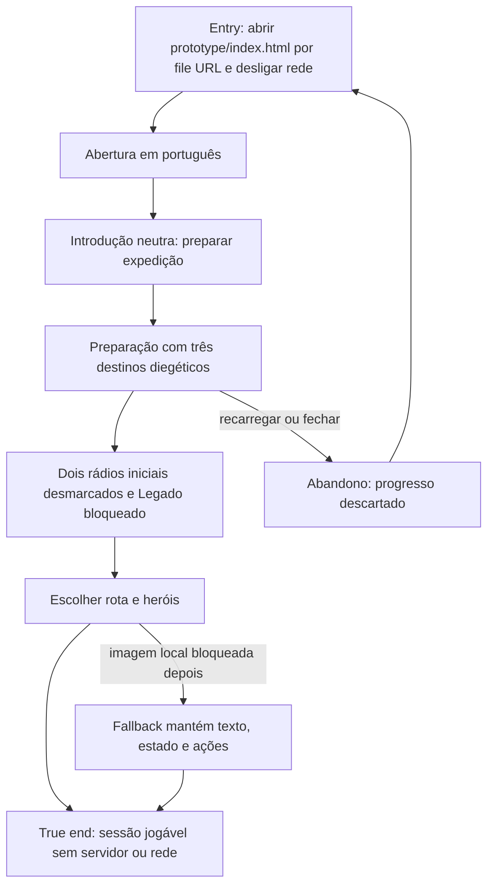

# Abrir e abandonar uma sessão local offline



```yaml
journey:
  id: J-local-offline-launch
  name: Abrir sessão local offline
  value_statement: "O jogador inicia uma campanha local e escolhe seu primeiro caminho sem instalação, servidor ou rede."
  personas: ["Lia, primeira expedicionária", "Rui, revisor de conteúdo"]
  entry_points:
    - url: file:///…/prototype/index.html
      origin: direct
  actions:
    - step: 1
      verb: Abrir o HTML local com rede desligada
      expected_observable: A abertura e a introdução neutra aparecem em português sem recurso remoto
    - step: 2
      verb: Preparar a expedição
      expected_observable: Caminho do Ferro e das Raízes e Caminho das Vozes e dos Espelhos aparecem como rádios desmarcados, enquanto Caminho do Legado aparece estático e bloqueado
    - step: 3
      verb: Escolher um caminho e três heróis
      expected_observable: A ação de partir nomeia o caminho escolhido e continua operável sem rede
  goal:
    observable: A preparação permite iniciar qualquer caminho inicial usando somente arquivos relativos locais
    side_effects: [sessao-em-memoria]
  true_end_state: Uma nova abertura volta ao início sem rota marcada, progresso anterior ou promessa de retomada
  exit:
    natural: limiar do caminho escolhido ou aba fechada
  abandonment:
    - at_step: 2
      how: Recarregar ou fechar a aba durante a preparação
      resume: Uma sessão limpa reapresenta os dois caminhos iniciais desmarcados
  crosses: [arquivos-locais, preparacao, fallback-de-imagem]
```
