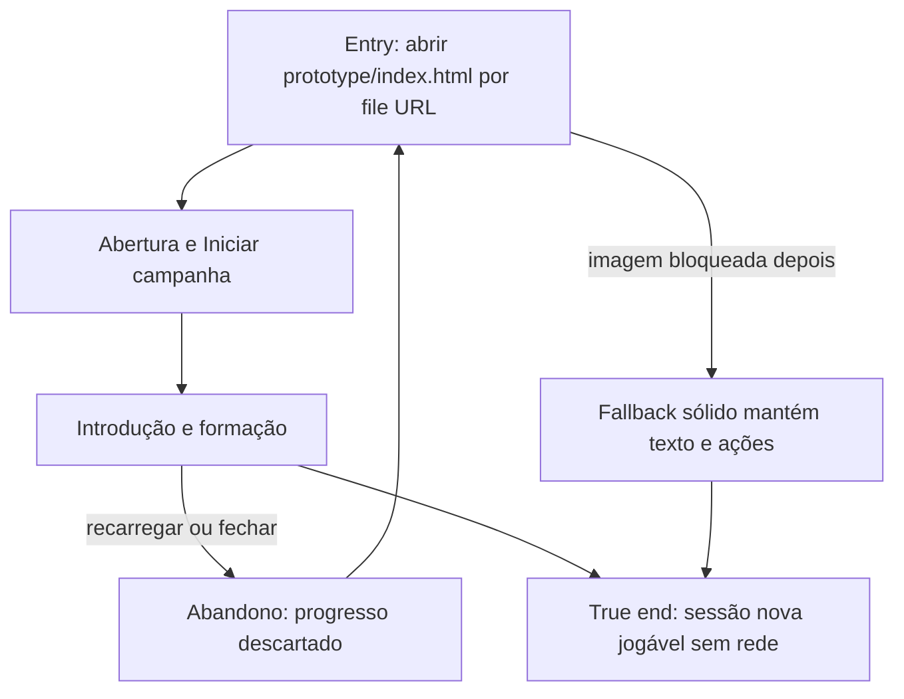

# Abrir e abandonar uma sessão local



```yaml
journey:
  id: J-local-offline-launch
  name: Abrir sessão local offline
  value_statement: "O jogador inicia uma campanha local sem instalação, servidor ou rede."
  personas: [Lia, primeira expedicionária, Rui, revisor de conteúdo]
  entry_points:
    - url: file:///…/prototype/index.html
      origin: direct
  actions:
    - step: 1
      verb: Abrir o HTML local com rede desligada
      expected_observable: Iniciar campanha aparece em português
    - step: 2
      verb: Iniciar e examinar o elenco
      expected_observable: Oito heróis e competências ficam disponíveis
  goal:
    observable: A formação está utilizável e nenhum recurso remoto é necessário
    side_effects: [sessao-em-memoria]
  true_end_state: Uma nova abertura volta ao início sem prometer retomada
  exit:
    natural: formação ou aba fechada
  abandonment:
    - at_step: 2
      how: Recarregar ou fechar a aba
      resume: Uma sessão limpa aparece
  crosses: [arquivos-locais, fallback-de-imagem]
```
