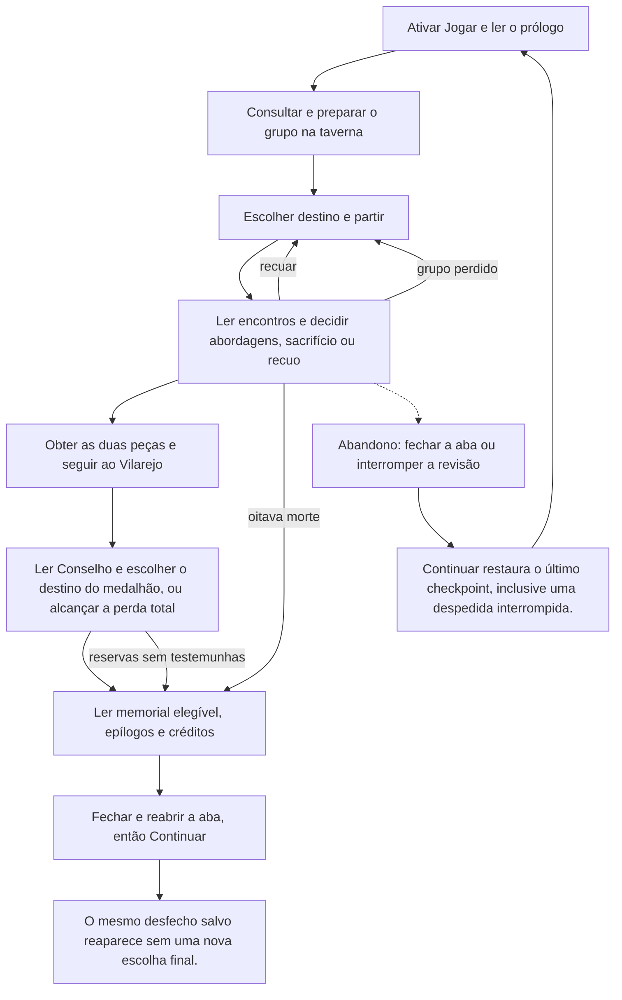

# Concluir uma campanha nativa e reencontrar seu desfecho



```yaml
journey:
  id: J-mz-complete-campaign
  name: "Concluir uma campanha nativa e reencontrar seu desfecho"
  value_statement: "Preparar uma expedição, lidar com perdas e concluir uma história que pode ser retomada."
  personas: ["Caio, estrategista recorrente","Lia, primeira expedicionária"]
  entry_points:
    - url: http://127.0.0.1:18726/
      origin: direct
  actions:
    - step: 1
      verb: "Ativar Jogar e ler o prólogo"
      expected_observable: "A superfície nativa responde à ação explícita e mantém a decisão anterior até novo aceite."
    - step: 2
      verb: "Consultar e preparar o grupo na taverna"
      expected_observable: "A superfície nativa responde à ação explícita e mantém a decisão anterior até novo aceite."
    - step: 3
      verb: "Escolher destino e partir"
      expected_observable: "A superfície nativa responde à ação explícita e mantém a decisão anterior até novo aceite."
    - step: 4
      verb: "Ler encontros e decidir abordagens, sacrifício ou recuo"
      expected_observable: "A superfície nativa responde à ação explícita e mantém a decisão anterior até novo aceite."
    - step: 5
      verb: "Obter as duas peças e seguir ao Vilarejo"
      expected_observable: "A superfície nativa responde à ação explícita e mantém a decisão anterior até novo aceite."
    - step: 6
      verb: "Ler Conselho e escolher o destino do medalhão, ou alcançar a perda total"
      expected_observable: "A superfície nativa responde à ação explícita e mantém a decisão anterior até novo aceite."
    - step: 7
      verb: "Ler memorial elegível, epílogos e créditos"
      expected_observable: "A superfície nativa responde à ação explícita e mantém a decisão anterior até novo aceite."
    - step: 8
      verb: "Fechar e reabrir a aba, então Continuar"
      expected_observable: "O mesmo desfecho salvo reaparece sem uma nova escolha final."
  goal:
    observable: "O mesmo desfecho salvo reaparece sem uma nova escolha final."
    side_effects: ["Checkpoints nativos preservam decisões aceitas e localização de mortes."]
  true_end_state: "O mesmo desfecho salvo reaparece sem uma nova escolha final."
  exit:
    natural: Título ou sessão local encerrada
  abandonment:
    - at_step: 4
      how: Fechar a aba ou suspender a revisão
      resume: "Continuar restaura o último checkpoint, inclusive uma despedida interrompida."
  crosses: ["Narrativa","Programação","UI/UX","Technical Art"]
```

Preparação, receitas, sensores e teardown: [plano MZ](../guides/native-mz-cycle.md). O histórico HTML permanece em suas próprias jornadas.
