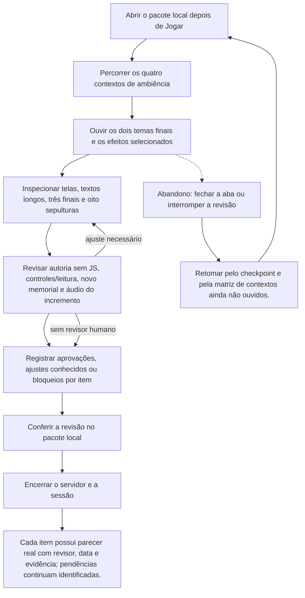

# Revisar a apresentação audiovisual e registrar o aceite humano



```yaml
journey:
  id: J-mz-creative-review
  name: "Revisar a apresentação audiovisual e registrar o aceite humano"
  value_statement: "Julgar a apresentação e o áudio alterados com evidência explícita de quem revisou."
  personas: ["Rui, revisor de conteúdo"]
  entry_points:
    - url: http://127.0.0.1:18726/
      origin: direct
  actions:
    - step: 1
      verb: "Abrir o pacote local depois de Jogar"
      expected_observable: "A superfície nativa responde à ação explícita e mantém a decisão anterior até novo aceite."
    - step: 2
      verb: "Percorrer os quatro contextos de ambiência"
      expected_observable: "A superfície nativa responde à ação explícita e mantém a decisão anterior até novo aceite."
    - step: 3
      verb: "Ouvir os dois temas finais e os efeitos selecionados"
      expected_observable: "A superfície nativa responde à ação explícita e mantém a decisão anterior até novo aceite."
    - step: 4
      verb: "Inspecionar telas, textos longos, três finais e oito sepulturas"
      expected_observable: "A superfície nativa responde à ação explícita e mantém a decisão anterior até novo aceite."
    - step: 5
      verb: "Revisar autoria sem JS, controles/leitura, novo memorial e áudio do incremento"
      expected_observable: "A superfície nativa responde à ação explícita e mantém a decisão anterior até novo aceite."
    - step: 6
      verb: "Registrar aprovações, ajustes conhecidos ou bloqueios por item"
      expected_observable: "A superfície nativa responde à ação explícita e mantém a decisão anterior até novo aceite."
    - step: 7
      verb: "Conferir a revisão no pacote local"
      expected_observable: "A superfície nativa responde à ação explícita e mantém a decisão anterior até novo aceite."
    - step: 8
      verb: "Encerrar o servidor e a sessão"
      expected_observable: "Cada item possui parecer real com revisor, data e evidência; pendências continuam identificadas."
  goal:
    observable: "Cada item possui parecer real com revisor, data e evidência; pendências continuam identificadas."
    side_effects: ["O relatório registra aceite humano separado dos sensores automatizados."]
  true_end_state: "Cada item possui parecer real com revisor, data e evidência; pendências continuam identificadas."
  exit:
    natural: Título ou sessão local encerrada
  abandonment:
    - at_step: 3
      how: Fechar a aba ou suspender a revisão
      resume: "Retomar pelo checkpoint e pela matriz de contextos ainda não ouvidos."
  crosses: ["Narrativa","UI/UX","Technical Art"]
```

Preparação, receitas, sensores e teardown: [plano MZ](../guides/native-mz-cycle.md). O histórico HTML permanece em suas próprias jornadas.

Para o incremento de bustos, seguir os [lotes nativos de diálogo](../guides/vn-picture-busts-dialogues.md). A jornada existente continua dona do fluxo; exportação, audição e aceite humano históricos não acrescentam gates ao incremento autorizado.

## Incremento eventbridge-minimal-runtime — 2026-09-12

Fluxo corrente: [guia e banco de checkpoints](../guides/eventbridge-minimal-runtime.md) e [relatório](../reports/2026-09-12-eventbridge-minimal-runtime.md). Seleção nativa de arquivos, chamadas diretas de CE, observação somente leitura e controles do provider substituem receitas de seed/API/revisão/S. Cenários deste incremento começam untested. Os relatórios anteriores preservam o histórico e não transferem PASS.


## Expansão de autoria por mapa — 2026-09-14

Abrir capturas jogadas de cada herói, Conselho, finais e memorial → conferir enquadramento/legibilidade → ouvir trilhas de Options/cues → registrar pessoa/data/decisão. Rejeição volta ao dono da superfície; ausência de julgamento permanece pendente. MA-A/B/F/G/I.

[Plano dirigido e sensores](../guides/eventbridge-minimal-runtime.md#expansão-de-autoria-por-mapa--plano-de-execução-2026-09-14). O relatório existente recebe os resultados novos; este planejamento não aprova execução nem substitui os julgamentos humanos.


## Integração narrativa aprovada — 2026-09-18

Planejado, execução dirigida ainda não observada. Cobertura: S-01/05/07/08/09/11; C/D/F. [Guia corrente](../guides/approved-narrative-dialogue-staging.md) e [charter](../charters/CH-approved-narrative-dialogue-staging.md). Preservar os vereditos históricos acima; fonte aprovada não aprova render/escuta do candidato. Sem zoom/gamepad. Prisões ausentes continuam no bug existente; prosa/arte aceitas e refinamento do memorial não são reabertos.
