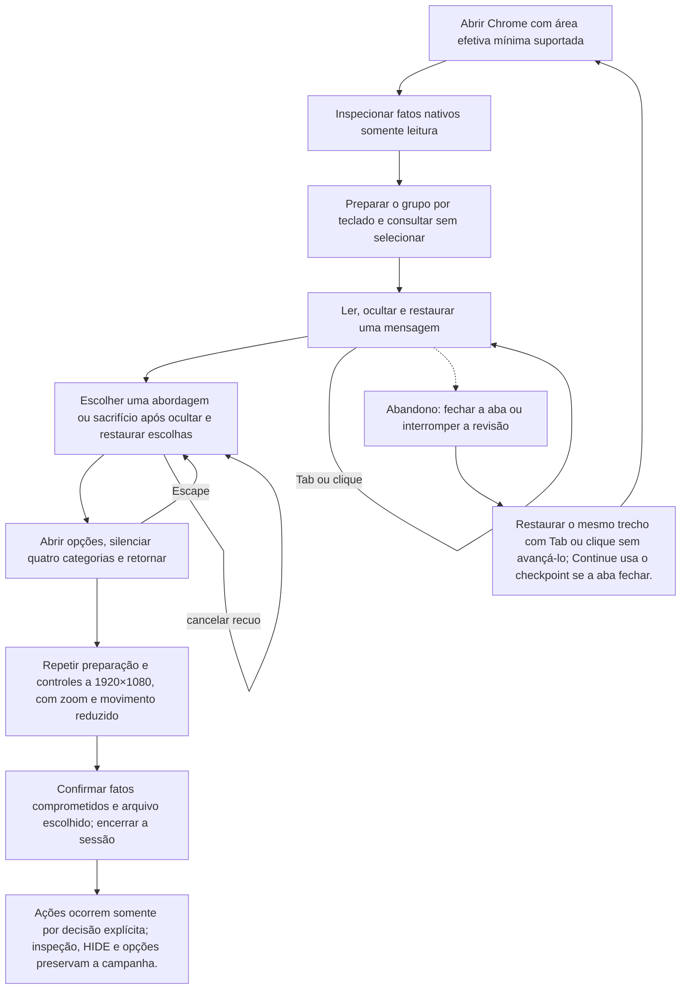

# Jogar por teclado com conforto e inspeção sem mutação



```yaml
journey:
  id: J-mz-qa-accessibility
  name: "Jogar por teclado com conforto e inspeção sem mutação"
  value_statement: "Ler e tomar decisões com foco visível, volume escolhido, HIDE e movimento reduzido."
  personas: ["Joana, jogadora ampliada"]
  entry_points:
    - url: http://127.0.0.1:18726/
      origin: direct
  actions:
    - step: 1
      verb: "Abrir Chrome com área efetiva mínima suportada"
      expected_observable: "A superfície nativa responde à ação explícita e mantém a decisão anterior até novo aceite."
    - step: 2
      verb: "Inspecionar fatos nativos somente leitura"
      expected_observable: "A superfície nativa responde à ação explícita e mantém a decisão anterior até novo aceite."
    - step: 3
      verb: "Preparar o grupo por teclado e consultar sem selecionar"
      expected_observable: "A superfície nativa responde à ação explícita e mantém a decisão anterior até novo aceite."
    - step: 4
      verb: "Ler, ocultar e restaurar uma mensagem"
      expected_observable: "A superfície nativa responde à ação explícita e mantém a decisão anterior até novo aceite."
    - step: 5
      verb: "Escolher uma abordagem ou sacrifício após ocultar e restaurar escolhas"
      expected_observable: "A superfície nativa responde à ação explícita e mantém a decisão anterior até novo aceite."
    - step: 6
      verb: "Abrir opções, silenciar quatro categorias e retornar"
      expected_observable: "A superfície nativa responde à ação explícita e mantém a decisão anterior até novo aceite."
    - step: 7
      verb: "Repetir preparação e controles a 1920×1080, com zoom e movimento reduzido"
      expected_observable: "A superfície nativa responde à ação explícita e mantém a decisão anterior até novo aceite."
    - step: 8
      verb: "Confirmar fatos comprometidos e arquivo escolhido; encerrar a sessão"
      expected_observable: "Ações ocorrem somente por decisão explícita; inspeção, HIDE e opções preservam a campanha."
  goal:
    observable: "Ações ocorrem somente por decisão explícita; inspeção, HIDE e opções preservam a campanha."
    side_effects: ["Preferências de áudio persistem separadamente da campanha."]
  true_end_state: "Ações ocorrem somente por decisão explícita; inspeção, HIDE e opções preservam a campanha."
  exit:
    natural: Título ou sessão local encerrada
  abandonment:
    - at_step: 4
      how: Fechar a aba ou suspender a revisão
      resume: "Restaurar o mesmo trecho com Tab ou clique sem avançá-lo; Continue usa o checkpoint se a aba fechar."
  crosses: ["UI/UX","Programação"]
```

Preparação, receitas, sensores e teardown: [plano MZ](../guides/native-mz-cycle.md). O histórico HTML permanece em suas próprias jornadas.

Para o incremento de bustos, seguir os [lotes nativos de diálogo](../guides/vn-picture-busts-dialogues.md). A jornada existente continua dona do fluxo; exportação, audição e aceite humano históricos não acrescentam gates ao incremento autorizado.

## Incremento eventbridge-minimal-runtime — 2026-09-12

Fluxo corrente: [guia e banco de checkpoints](../guides/eventbridge-minimal-runtime.md) e [relatório](../reports/2026-09-12-eventbridge-minimal-runtime.md). Seleção nativa de arquivos, chamadas diretas de CE, observação somente leitura e controles do provider substituem receitas de seed/API/revisão/S. Cenários deste incremento começam untested. Os relatórios anteriores preservam o histórico e não transferem PASS.


## Expansão de autoria por mapa — 2026-09-14

Menu do herói ou passagem de campanha → HIDE/Options → restaurar o mesmo contexto → FAST apenas no trecho concluído → próxima escolha sem confirmação carregada.1280×720 normal,1920×1080 reduzido e zoom nativo110% no mínimo efetivo. MA-A/B/F.

[Plano dirigido e sensores](../guides/eventbridge-minimal-runtime.md#expansão-de-autoria-por-mapa--plano-de-execução-2026-09-14). O relatório existente recebe os resultados novos; este planejamento não aprova execução nem substitui os julgamentos humanos.


## Prólogo de Rheed — 2026-09-17

O [plano incremental](../guides/prologo-rheed.md) cobre a entrada local nativa, abertura, controles, retomada e retorno à preparação. Usa o roteiro N01–N06, checkpoints genuínos e inspeção somente leitura. [Ciclo concluído no escopo aceito](../reports/2026-09-17-prologo-rheed.md#fechamento-do-ciclo). Não reutilizar procedimentos do protótipo HTML.
