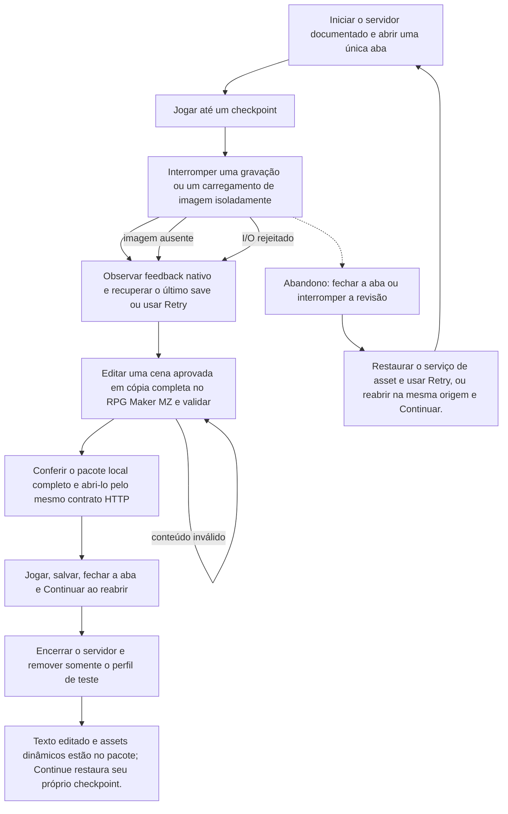

# Retomar uma campanha no pacote local após interrupção



```yaml
journey:
  id: J-mz-recovery-export
  name: "Retomar uma campanha no pacote local após interrupção"
  value_statement: "Editar uma cena em cópia completa e recuperar uma campanha no arquivo correto sem perder decisões válidas."
  personas: ["Rui, revisor de conteúdo"]
  entry_points:
    - url: http://127.0.0.1:18726/
      origin: direct
  actions:
    - step: 1
      verb: "Iniciar o servidor documentado e abrir uma única aba"
      expected_observable: "A superfície nativa responde à ação explícita e mantém a decisão anterior até novo aceite."
    - step: 2
      verb: "Jogar até um checkpoint"
      expected_observable: "A superfície nativa responde à ação explícita e mantém a decisão anterior até novo aceite."
    - step: 3
      verb: "Interromper uma gravação ou um carregamento de imagem isoladamente"
      expected_observable: "A superfície nativa responde à ação explícita e mantém a decisão anterior até novo aceite."
    - step: 4
      verb: "Observar feedback nativo e recuperar o último save ou usar Retry"
      expected_observable: "A superfície nativa responde à ação explícita e mantém a decisão anterior até novo aceite."
    - step: 5
      verb: "Editar uma cena aprovada em cópia completa no RPG Maker MZ e validar"
      expected_observable: "A superfície nativa responde à ação explícita e mantém a decisão anterior até novo aceite."
    - step: 6
      verb: "Conferir o pacote local completo e abri-lo pelo mesmo contrato HTTP"
      expected_observable: "A superfície nativa responde à ação explícita e mantém a decisão anterior até novo aceite."
    - step: 7
      verb: "Jogar, salvar, fechar a aba e Continuar ao reabrir"
      expected_observable: "A superfície nativa responde à ação explícita e mantém a decisão anterior até novo aceite."
    - step: 8
      verb: "Encerrar o servidor e remover somente o perfil de teste"
      expected_observable: "Texto editado e assets dinâmicos estão no pacote; Continue restaura seu próprio checkpoint."
  goal:
    observable: "Texto editado e assets dinâmicos estão no pacote; Continue restaura seu próprio checkpoint."
    side_effects: ["O arquivo selecionado e seu índice são persistidos na mesma origem e perfil isolados."]
  true_end_state: "Texto editado e assets dinâmicos estão no pacote; Continue restaura seu próprio checkpoint."
  exit:
    natural: Título ou sessão local encerrada
  abandonment:
    - at_step: 3
      how: Fechar a aba ou suspender a revisão
      resume: "Restaurar o serviço de asset e usar Retry, ou reabrir na mesma origem e Continuar."
  crosses: ["Programação","Technical Art"]
```

Preparação, receitas, sensores e teardown: [plano MZ](../guides/native-mz-cycle.md). O histórico HTML permanece em suas próprias jornadas.

Para o incremento de bustos, seguir os [lotes nativos de diálogo](../guides/vn-picture-busts-dialogues.md). A jornada existente continua dona do fluxo; exportação, audição e aceite humano históricos não acrescentam gates ao incremento autorizado.

## Incremento eventbridge-minimal-runtime — 2026-09-12

Fluxo corrente: [guia e banco de checkpoints](../guides/eventbridge-minimal-runtime.md) e [relatório](../reports/2026-09-12-eventbridge-minimal-runtime.md). Seleção nativa de arquivos, chamadas diretas de CE, observação somente leitura e controles do provider substituem receitas de seed/API/revisão/S. Cenários deste incremento começam untested. Os relatórios anteriores preservam o histórico e não transferem PASS.


## Expansão de autoria por mapa — 2026-09-14

Cópia no MZ → editar fala em Map002 e Map038 → salvar → Novo jogo → jogar ambas as falas; após campanha, fechar/reabrir → escolher o arquivo verdadeiro → comparar o limite salvo. Cancelar seletor preserva arquivos. MA-A/F/I.

[Plano dirigido e sensores](../guides/eventbridge-minimal-runtime.md#expansão-de-autoria-por-mapa--plano-de-execução-2026-09-14). O relatório existente recebe os resultados novos; este planejamento não aprova execução nem substitui os julgamentos humanos.
