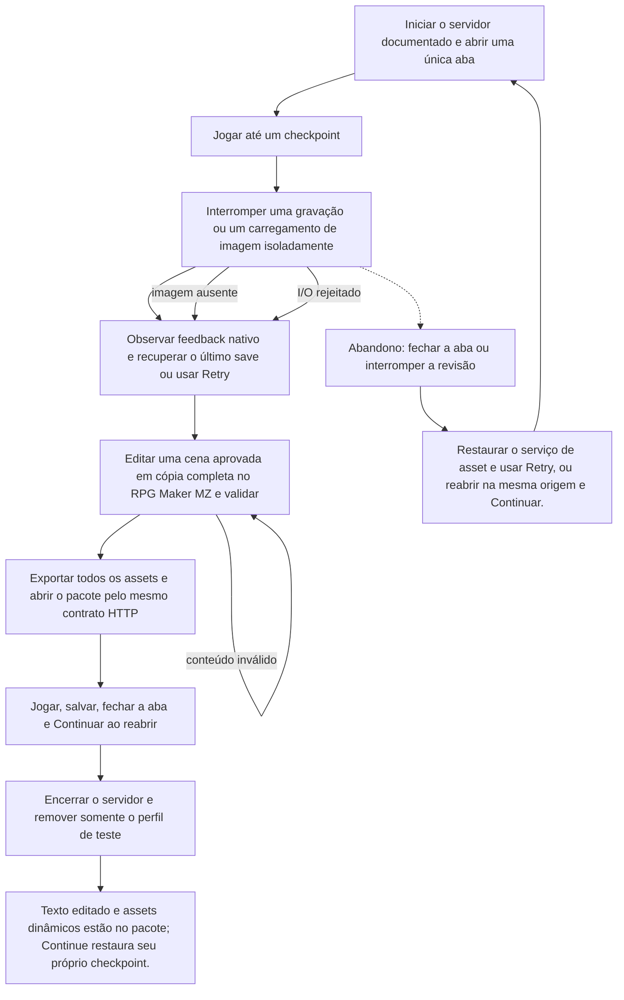

# Retomar uma campanha no pacote local após interrupção



```yaml
journey:
  id: J-mz-recovery-export
  name: "Retomar uma campanha no pacote local após interrupção"
  value_statement: "Editar uma cena em cópia, exportar seus arquivos e recuperar uma campanha sem perder decisões válidas."
  personas: ["Rui, revisor de conteúdo"]
  entry_points:
    - url: http://127.0.0.1:18726/
      origin: direct
  actions:
    - step: 1
      verb: "Iniciar o servidor documentado e abrir uma única aba"
      expected_observable: "A superfície nativa responde à ação explícita e mantém a decisão anterior até novo aceite."
    - step: 2
      verb: "Jogar até um checkpoint"
      expected_observable: "A superfície nativa responde à ação explícita e mantém a decisão anterior até novo aceite."
    - step: 3
      verb: "Interromper uma gravação ou um carregamento de imagem isoladamente"
      expected_observable: "A superfície nativa responde à ação explícita e mantém a decisão anterior até novo aceite."
    - step: 4
      verb: "Observar feedback nativo e recuperar o último save ou usar Retry"
      expected_observable: "A superfície nativa responde à ação explícita e mantém a decisão anterior até novo aceite."
    - step: 5
      verb: "Editar uma cena aprovada em cópia completa no RPG Maker MZ e validar"
      expected_observable: "A superfície nativa responde à ação explícita e mantém a decisão anterior até novo aceite."
    - step: 6
      verb: "Exportar todos os assets e abrir o pacote pelo mesmo contrato HTTP"
      expected_observable: "A superfície nativa responde à ação explícita e mantém a decisão anterior até novo aceite."
    - step: 7
      verb: "Jogar, salvar, fechar a aba e Continuar ao reabrir"
      expected_observable: "A superfície nativa responde à ação explícita e mantém a decisão anterior até novo aceite."
    - step: 8
      verb: "Encerrar o servidor e remover somente o perfil de teste"
      expected_observable: "Texto editado e assets dinâmicos estão no pacote; Continue restaura seu próprio checkpoint."
  goal:
    observable: "Texto editado e assets dinâmicos estão no pacote; Continue restaura seu próprio checkpoint."
    side_effects: ["O arquivo nativo file0 é persistido na origem e no perfil isolados."]
  true_end_state: "Texto editado e assets dinâmicos estão no pacote; Continue restaura seu próprio checkpoint."
  exit:
    natural: Título ou sessão local encerrada
  abandonment:
    - at_step: 3
      how: Fechar a aba ou suspender a revisão
      resume: "Restaurar o serviço de asset e usar Retry, ou reabrir na mesma origem e Continuar."
  crosses: ["Programação","Technical Art"]
```

Preparação, receitas, sensores e teardown: [plano MZ](../guides/native-mz-cycle.md). O histórico HTML permanece em suas próprias jornadas.
