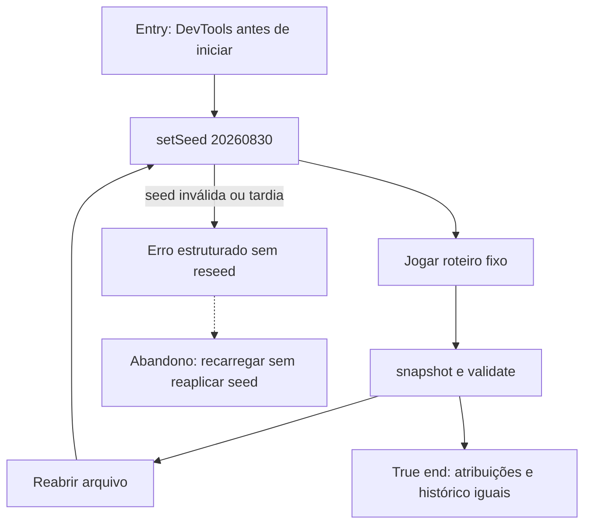

# Reproduzir uma campanha



```yaml
journey:
  id: J-reproduce-campaign
  name: Reproduzir campanha por seed
  value_statement: "O operador transforma um relato em duas sessões comparáveis sem alterar o domínio."
  personas: ["Caio, estrategista recorrente", "Joana, jogadora ampliada"]
  entry_points:
    - url: file:///…/prototype/index.html
      origin: direct
  actions:
    - step: 1
      verb: Definir seed antes do início
      expected_observable: setSeed retorna ok e a seed pendente é inspecionável
    - step: 2
      verb: Repetir as mesmas ações em duas sessões
      expected_observable: Atribuições e histórico são idênticos
    - step: 3
      verb: Validar e tentar uma seed tardia
      expected_observable: validate não muda estado e reseed é rejeitado
  goal:
    observable: Dois snapshots v1 iguais explicam a reprodução
    side_effects: [nenhum-estado-duravel]
  true_end_state: A sessão continua jogável e o objeto global segue com três métodos
  exit:
    natural: relatório de QA com seed e roteiro
  abandonment:
    - at_step: 2
      how: Recarregar sem reaplicar a seed
      resume: Snapshot pronto retorna seed nula
  crosses: [devtools, controlador, motor-deterministico]
```
