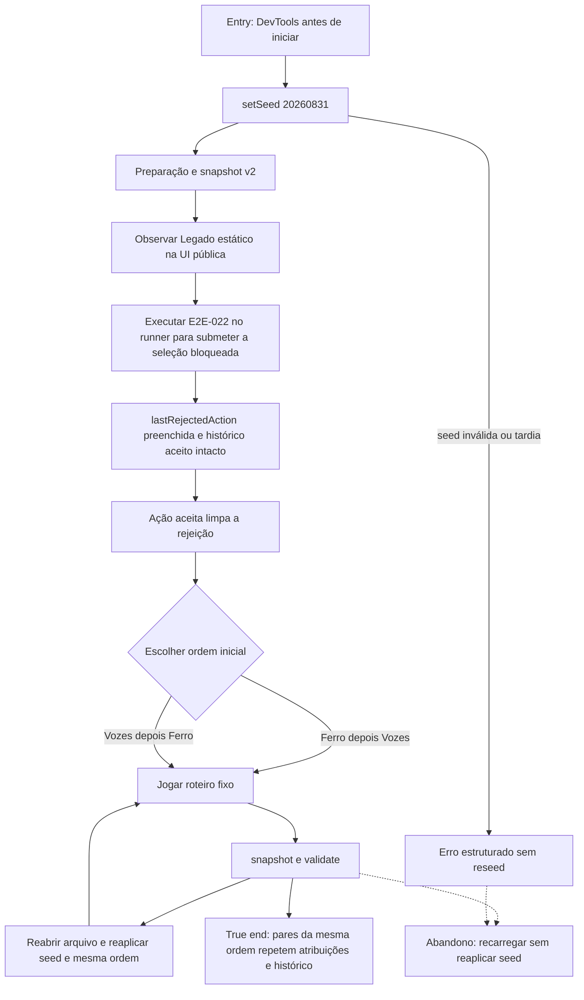

# Reproduzir uma campanha com o contrato QA v2



```yaml
journey:
  id: J-reproduce-campaign
  name: Reproduzir campanha por seed e ordem
  value_statement: "O operador reproduz qualquer ordem inicial e diagnostica rejeições sem mutar o domínio nem criar backdoors."
  personas: ["Caio, estrategista recorrente", "Joana, jogadora ampliada"]
  entry_points:
    - url: file:///…/prototype/index.html
      origin: direct
    - url: Chrome DevTools — window.expeditionQA.setSeed, snapshot e validate
      origin: direct
    - url: file:///…/prototype/tests.html — E2E-022
      origin: direct
  actions:
    - step: 1
      verb: Definir seed 20260831 antes do início e inspecionar snapshot v2
      expected_observable: setSeed retorna ok e snapshot expõe seleção, rota ativa, progresso, partes, formação, histórico e rejeição nula
    - step: 2
      verb: Observar o Legado estático na sessão pública e executar E2E-022 no runner para submeter a seleção bloqueada
      expected_observable: A sessão pública confirma que o cartão não é acionável; o fixture registra destination_unavailable fora do histórico e a seleção aceita seguinte limpa lastRejectedAction
    - step: 3
      verb: Repetir ações idênticas em duas sessões para cada ordem inicial
      expected_observable: Cada par repete atribuições, progresso e histórico; ambas as ordens convergem para os mesmos candidatos finais
    - step: 4
      verb: Executar validate e tentar seed inválida ou tardia
      expected_observable: validate não muta estado, os erros são estruturados e o objeto público continua com exatamente três métodos
  goal:
    observable: Snapshots v2 da mesma seed, ordem e roteiro são iguais, e diagnósticos não alteram a história aceita
    side_effects: [nenhum-estado-duravel]
  true_end_state: A sessão continua jogável e window.expeditionQA expõe somente setSeed, snapshot e validate
  exit:
    natural: relatório de QA com seed, ordem, roteiro e snapshots comparáveis
  abandonment:
    - at_step: 3
      how: Recarregar sem reaplicar a seed
      resume: Snapshot pronto retorna seed nula, zero partes e nenhuma rota ativa
  crosses: [devtools, controlador, motor-deterministico, selecao-de-caminho]
```
