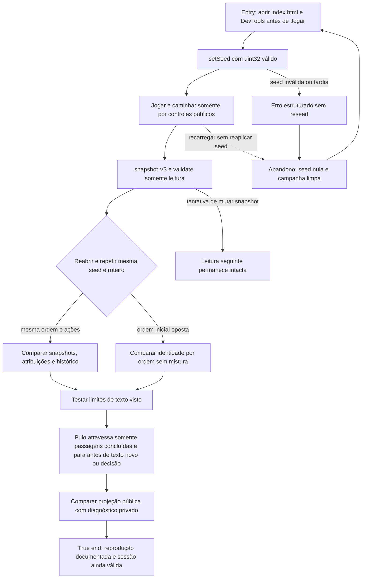

> Historical record: the HTML implementation has been retired. Procedures and source references below describe that past delivery only; do not execute them, recover its source, or treat its results as evidence of the current game. Current implementation: `rpg-maker/The Dryland Drowned/`; current tests: `rpg-maker/tests/`.

# Reproduzir uma campanha com o contrato QA V3



```yaml
journey:
  id: J-reproduce-campaign
  name: Reproduzir campanha por seed e ordem
  value_statement: "O operador reproduz decisões e diagnostica rejeições sem alterar o domínio nem revelar fatos privados ao jogador."
  personas: ["Caio, estrategista recorrente", "Joana, jogadora ampliada"]
  entry_points:
    - url: retired HTML artifact (index.html)
      origin: direct
    - url: Chrome DevTools — window.expeditionQA.setSeed, snapshot e validate
      origin: direct
  actions:
    - step: 1
      verb: Definir seed uint32 antes de Jogar
      expected_observable: setSeed aceita 0 e 4294967295, rejeita valores inválidos e não aceita reseed depois do início
    - step: 2
      verb: Repetir a mesma ordem e ações em sessões frescas
      expected_observable: Snapshots V3 repetem atribuições, progressos, leitura, inventário, desfecho e histórico aceito
    - step: 3
      verb: Consultar snapshot e validate e tentar alterar os objetos retornados
      expected_observable: As leituras são destacadas e não mutantes; window.expeditionQA continua expondo exatamente setSeed, snapshot e validate
    - step: 4
      verb: Comparar conteúdo visível ao jogador com o diagnóstico
      expected_observable: Nomes, rumores, progresso conhecido e consequências públicas aparecem; competências, cobertura, viabilidade, seed, IDs internos e atribuições futuras ficam somente no diagnóstico
    - step: 5
      verb: Completar, revisitar e tentar pular passagens vistas e inéditas
      expected_observable: Apenas texto explicitamente concluído nesta campanha é pulável e uma ativação para antes do primeiro texto novo ou decisão
  goal:
    observable: A mesma seed e roteiro reproduzem o estado V3 sem backdoor, vazamento privado ou avanço por inspeção
    side_effects: [nenhum-estado-duravel]
  true_end_state: A reprodução termina com snapshot comparável, validate válido e campanha ainda operável pelos controles do jogador
  exit:
    natural: registro da seed, ordem, roteiro e snapshots comparáveis
  abandonment:
    - at_step: 2
      how: Recarregar sem reaplicar a seed
      resume: Snapshot pronto retorna seed nula, histórico vazio e nenhuma rota ativa
    - at_step: 5
      how: Fechar antes de completar uma passagem inédita
      resume: Nova campanha não herda elegibilidade de pulo
  crosses: [S02, S04, S05, S08, S09, S10, S12, diagnostico-v3]
```
