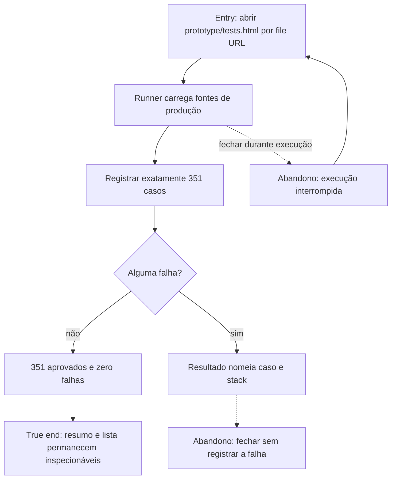

# Executar o contrato automatizado local



```yaml
journey:
  id: J-run-browser-contract
  name: Executar contrato do navegador
  value_statement: "O colaborador verifica o contrato completo de seleção de caminhos e campanha sem instalar ferramentas."
  personas: ["Caio, estrategista recorrente"]
  entry_points:
    - url: file:///…/prototype/tests.html
      origin: direct
  actions:
    - step: 1
      verb: Abrir o runner local em Chrome
      expected_observable: As fontes de produção são carregadas e exatamente 351 casos são registrados
    - step: 2
      verb: Aguardar a execução completa
      expected_observable: O resumo informa 351 aprovados, zero falhas e 351 no total
  goal:
    observable: O resumo mostra exatamente 351 aprovados e zero falhas, incluindo as duas ordens completas
    side_effects: [relatorio-em-memoria]
  true_end_state: O resumo, a lista de resultados e window.__expeditionTestResults permanecem inspecionáveis na aba
  exit:
    natural: aba de testes com PASS visível
  abandonment:
    - at_step: 2
      how: Fechar durante a execução
      resume: Nova abertura reinicia a suíte completa desde o primeiro caso
  crosses: [fontes-de-producao, runner-local, contrato-qa-v2]
```
