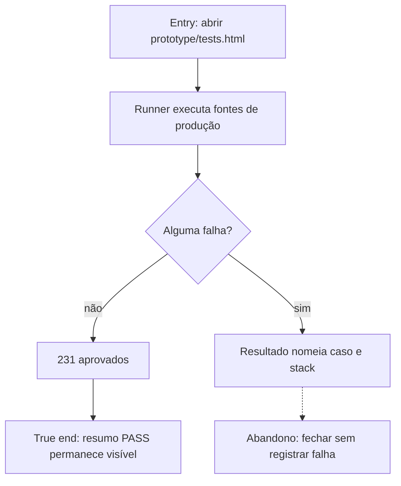

# Executar o contrato automatizado local



```yaml
journey:
  id: J-run-browser-contract
  name: Executar contrato do navegador
  value_statement: "O colaborador verifica o protótipo sem instalar ferramentas."
  personas: [Caio, estrategista recorrente]
  entry_points:
    - url: file:///…/prototype/tests.html
      origin: direct
  actions:
    - step: 1
      verb: Abrir o runner local
      expected_observable: Todos os casos são executados em sequência
  goal:
    observable: O resumo mostra 231 aprovados e zero falhas
    side_effects: [relatorio-em-memoria]
  true_end_state: O resumo e a lista de resultados permanecem inspecionáveis
  exit:
    natural: aba de testes
  abandonment:
    - at_step: 1
      how: Fechar durante a execução
      resume: Nova abertura reinicia a suíte completa
  crosses: [fontes-de-producao, runner-local]
```
