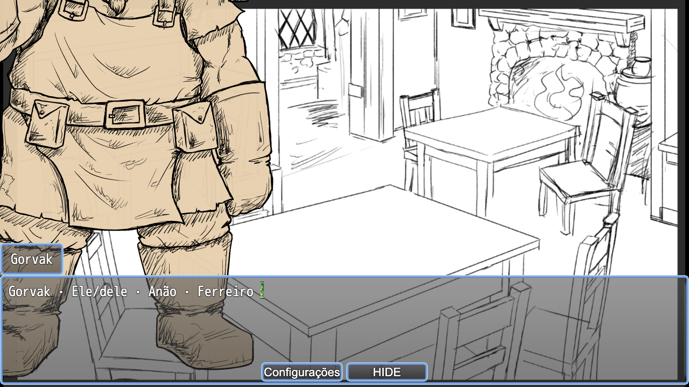

# Verification — native bust authorship

Technical scope: the [approved spec](spec.md), on branch `refactor/native-bust-restoration`, based on `3513a0f925ff101a759723537e764a8dc407ae67`. Work performed on 2026-09-11 with Node v22.23.2 and the installed Chrome/MZ/vendor stack. No engine, vendor or asset file changed.

## Implementation verification before the artist edit (2026-09-11)

| Requirement | Sensor and result |
| --- | --- |
| RQ001 | PASS — UT-067 and UT-073 accept native origins, mirroring, curves, expressions, arbitrary picture IDs, long durations and additional vendor commands; inspection never evaluates expressions. Campaign commands and malformed helper graphs remain rejected. |
| RQ002 | PASS — zero EventBridge Focus calls remain. Global style metadata and configured parameters removed. Native default focus migrated to editable helpers; 32 tavern calls use CE080/081, 45 redundant solo calls removed, 14 helpers remain. Narrative and choice commands in events 1–67 compare equal to the baseline. |
| RQ003 | PASS — UT-071/072/074 check inherited sources, native branches, visual command ordering and exclusion of narrative/campaign operations. IT-067 covers a graphic change after the final text of an inherited source. IT-069 proves relative scaling, image change, native tone preset, origin and mirroring through Options and Continue. |
| RQ004 | PASS — IT-060/064/066 cover cold-loading cancellation and cleanup; IT-062/063 cover native Continue and Council; IT-065 covers partial/full seen-text skip; IT-068 covers four native manual focuses, repeated composition, HIDE, cold/warm entry and normal/reduced motion at two desktop sizes. IT-069 confirms cleanup of a picture outside the former reserved range. |
| RQ005 | PASS — content CLI, syntax checks, structural narrative comparison and migration reconstruction. That run used native revision `mz-20260911-native-bust-authorship-02`. Old saves remain stored but incompatible. README/GDD and known-issue history identify the new visual ownership. |

At that verification, the plugin SHA-256 was `b7db900e711864b365fb7b7cb5a47c7335c1c97ae2a847c589fbca21adb0cfbb`; CommonEvents SHA-256 is `f49bcfb35b37804e620ee6201629582bdcedbd50130629db6d5cbdc1d30b7fc2`. The local-only evidence inventory at `docs/qa/evidence/vn-native-bust-authorship/verification-inputs.json` records the full candidate and test input hashes. Documentation changes do not invalidate runtime evidence.

## Commands

All commands run from the repository root. The test ports isolate these runs from the user's existing Python server on 18726, which remained running.

| Command | Result |
| --- | --- |
| `DRYLAND_QA_PORT=18728 node --test --test-name-pattern='UT-' rpg-maker/tests/*.test.mjs` | PASS, 74/74, exit 0. |
| `DRYLAND_QA_PORT=18729 node --test --test-name-pattern='IT-040\|IT-046\|IT-060\|IT-062\|IT-065\|IT-066\|IT-067' rpg-maker/tests/*.test.mjs` | PASS, 7/7, exit 0. |
| `DRYLAND_QA_PORT=18730 node --test --test-name-pattern='IT-063\|IT-064\|IT-068' rpg-maker/tests/*.test.mjs` | PASS, 3/3, exit 0; final repeated batch uses the reviewed plugin. |
| `DRYLAND_QA_PORT=18729 node --test --test-name-pattern='IT-069' rpg-maker/tests/*.test.mjs` | PASS, 1/1, exit 0. |
| `node rpg-maker/tools/validate-content.mjs --json` | PASS, `{"ok":true,"errors":[]}`, exit 0. |
| Plugin and migration `node --check`, Python migration AST parse, `git diff --check` | PASS. |

The seven-case runtime batch used the final plugin. UT-071 subsequently gained an additional pure extraction assertion; those seven integration bodies and their fixtures were unchanged, so their runtime evidence is retained. The final unit run includes that assertion. This records 85 distinct passing canonical tests, not a complete unchanged-campaign replay.

Both materialized migrations were executed against a disposable reconstruction of the base revision. The generated plugin and plugins.js match the final bytes, and CommonEvents plus the 2×2 fixture match the final parsed JSON. The scripts refuse the already-migrated project; they are historical transformations, not the artist's editing workflow.

## Review, failures and limits

The [independent review](review.md) is SHIP for code. Two findings were fixed: restore the unrelated invalid-campaign interpreter barrier, and include trailing visual commands from completed inherited sources. Their respective diagnostics and source-tail regressions pass. Parent diff/deslop review found no unrelated runtime rewrite, dependency, duplicate suite or suppression.

During development, the old base-relative assertions failed after migration because native helpers now own explicit values; the tests now edit those native helper values. The new artist case initially expected positive X scale despite native mirroring; its oracle was corrected to -80% X / 80% Y. A browser-reopen readiness assertion was corrected to wait for the game's globals. Final passing runs follow those corrections; none of the failures is presented as successful evidence.

IT-069's restored screenshot was opened and inspected: the test deliberately uses a different local character image, centered origin, mirroring, 80% scale and a warm tone to exercise vendor parameters. Its oversized/cropped image is a technical fixture, not approved art framing, and it is not published into game data. The game retains its existing assets and creative acceptance status. No native editor UI walkthrough or human creative acceptance is claimed.

Restoration targets the final composition. One-shot battle animations do not replay; continuous effects may restart their phase. Vendor expressions are reevaluated against current state and must be pure. Exact interrupted animation frames and historical results of random/time-dependent expressions remain excluded by ADR001.

## Candidate audit and organization

Keep the runtime/plugin configuration, native events and manifest: these are the game's sources. Keep the CLI and canonical fixture/test edits: they cover the new authoring boundary. Keep the GDD, artist guide and dated known-issue updates: they prevent the old global-focus contract from remaining current guidance. Keep this spec, decision, tasks, review, verification and migration scripts: they own the change and its reproduction. The earlier `vn-speaker-scale-reduction` files remain explicitly superseded history, with the original uncommitted work also preserved in stash `e64b84a0663751ecde0992bd52db2c750ee8c3ed`.

The concurrently created `planos/tasks/vn-speaker-scale-reduction/entrevista.md` is outside this delivery: it was preserved without edits and excluded from the verified candidate set.

Detailed logs, screenshots and candidate hashes stay in the existing ignored QA evidence tree. They are local execution evidence, not fresh-clone dependencies. Reproduction uses maintained tests and the installed local engine/vendor files. At that stage, no files were staged, committed or published, and no user server or save was removed.

Devlog suggestion: edit CE005's visual settings and show the same composition after Options; use the technical screenshots only to explain behavior, not as final game art. The README identifies native focus helpers CE080/081 for the artist.

## Initial verdict

**PASS — contracted technical increment.** All 85 selected canonical tests passed; static checks and independent code review passed. This was not whole-game release or creative approval. The branch was uncommitted at that verification.

## Final verification and publication candidate — 2026-09-11

The user reported that the change worked in their test, including Gorvak's edited scale, and subsequently authorized final verification, commit and a PR to `main` if successful. This accepts the technical delivery; it does not approve final framing or the game's provisional assets.

The current data includes the user's CE005 scale of **50% on both axes**, its editor annotations, and the editor's `jsonFormatLevel: 2` and updated `versionId`. Comparison against a disposable baseline migration found no other semantic event changes. All narrative and choice commands remain equal to the baseline. CE080/081 retain their explicit values: changing the profile entry does not automatically change later manual focus commands.

The editor's expanded JSON and plugin serialization was returned to the repository's compact style with parsed-value equality checked before and after every write. Original bytes are preserved locally in `docs/qa/evidence/vn-native-bust-authorship/final-verify/editor-backup/`; no authored value was discarded. Twelve unrelated database files now match HEAD. The final native revision is `mz-20260911-native-bust-authorship-04`; revision 03 records the preceding expanded serialization. Previous saves remain stored and incompatible.

### Fresh evidence

- `DRYLAND_QA_PORT=18728 node --test --test-name-pattern='UT-|IT-040|IT-046|IT-060|IT-062|IT-063|IT-064|IT-065|IT-066|IT-067|IT-068|IT-069' rpg-maker/tests/*.test.mjs`: **84/85 passed, exit 1**. The only failure was IT-067's setup assertion requiring the authored Gorvak scale to remain 100%; current authoring correctly contains 50%.
- SUT_IS_CORRECT_BECAUSE: the approved contract gives the artist ownership of entry scale. IT-067 configures its disposable entry at 44% and checks actual MZ playback and recovery at 44%, 39.6% and 80%. Its initial 100%/X=200 precondition was unrelated to those outcomes and prevented the test from exercising valid artist edits. Only that precondition was removed; runtime assertions remain unchanged. A redundant blank line in native-controls was also removed.
- `DRYLAND_QA_PORT=18729 node --test --test-name-pattern='IT-067' rpg-maker/tests/*.test.mjs`: **1/1 passed, exit 0**, after correcting the test setup. The other 84 results retain their scope: no production change, fixture change, or behavioral assertion change affects them. This yields **85 distinct passing cases: 74 UT and 11 IT**, not a single all-green aggregate invocation.
- `node rpg-maker/tools/validate-content.mjs --json`: **PASS**, no errors; JavaScript syntax and `git diff --check`: **PASS**.

The original review still applies to the unchanged EventBridge plugin. The additional review covers the 50% authored scale, four 657 editor annotations, System editor metadata, compact serialization and IT-067 setup correction. No dependency, engine, vendor, image source or campaign rule changed.

A supplemental read-only observation of native playback on Chrome 153.0.8010.36 confirmed Gorvak at X=200, Y=725, scale 50%/50%, before and after Options, with unchanged campaign data. The local `final-verify/gorvak.mjs` run exited 0; `gorvak.json` records both observations. This is additional runtime evidence, not an extra canonical test or independent directed playtest.

The capture was opened and checked. It shows the current cropped character framing; it proves neither final art approval nor complete visual composition. Devlog use: demonstrate editable native scale and restoration, with final framing left to Technical Art.

### Candidate audit and organization

Keep the 14 modified source/documentation/test paths, seven native-authorship spec/review/migration files and three superseded scale-fix historical files. System.json is included because its editor metadata was authored alongside this change and its bytes are referenced by the manifest. Keep one selected runtime capture beside this verification for review/devlog use; its framing is provisional. The older scale-fix verification is explicitly historical. Required links resolve to tracked or selected files.

Defer only `planos/tasks/vn-speaker-scale-reduction/entrevista.md`: it belongs to a concurrent interview and remains untouched and uncommitted. Detailed logs, formatting script, original-byte backups and current candidate hashes stay in the existing ignored evidence tree. These local archives are not available from a fresh clone; maintained tests and the selected capture remain available there. No archive source was deleted.

**Final verdict: PASS for the contracted technical delivery and the selected PR candidate.** No whole-game release, independent directed playtest or final artistic acceptance is claimed. Commit and PR publication are authorized; their resulting identifiers are reported by the delivery message.
